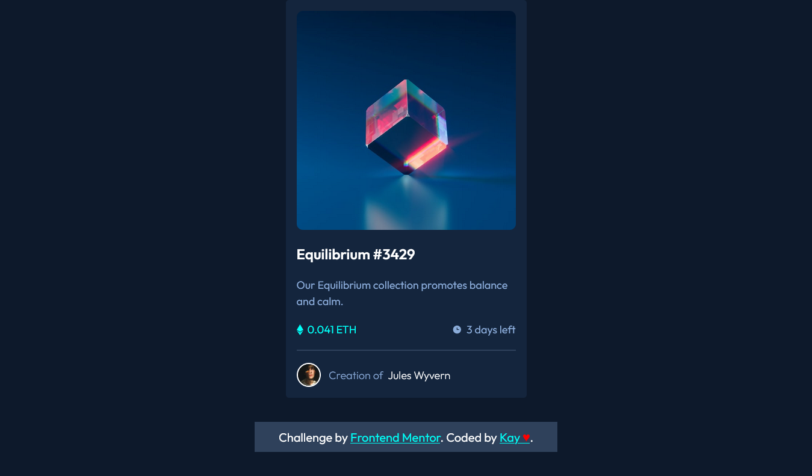

# Frontend Mentor - NFT preview card component solution

This is a solution to the
[NFT preview card component challenge on Frontend Mentor](https://www.frontendmentor.io/challenges/nft-preview-card-component-SbdUL_w0U).
Frontend Mentor challenges help you improve your coding skills by building
realistic projects.

## Table of contents

- [The challenge](#the-challenge)
- [Screenshot](#screenshot)
- [Links](#links)
- [Built with](#built-with)
- [What I learned](#what-i-learned)
- [Continued development](#continued-development)
- [Author](#author)

### The challenge

Users should be able to:

- View the optimal layout depending on their device's screen size
- See hover states for interactive elements

### Screenshot

### Links

- Solution URL:
  [https://github.com/ofthewildfire/FEM-Nft-preview-card](https://github.com/ofthewildfire/FEM-Nft-preview-card)
- Live Site URL:
  [https://fem-nft-preview-card-kc.vercel.app/](https://fem-nft-preview-card-kc.vercel.app/)

### Built with

- Semantic HTML5 markup
- CSS custom properties
- Flexbox
- CSS Grid
- Mobile-first workflow

### What I learned

I learned how to make an overlay with a hover, it honestly took me a hot minute,
but also, I wanted to do the correct version with pseudo before and after but I
wasn't able to. I will have to read more and implement that change, and oh gosh,
I need to change the way the card is. But, really I think its alright for
sharing now.

### Continued development

More work on the hover state, as well as accessibility for screenreaders, its
actually not set up at all.

## Author

- Frontend Mentor -
  [@ofthewildfire](https://www.frontendmentor.io/profile/ofthewildfire)
- Twitter - [@km_fsdev](https://www.twitter.com/km_fsdev)
